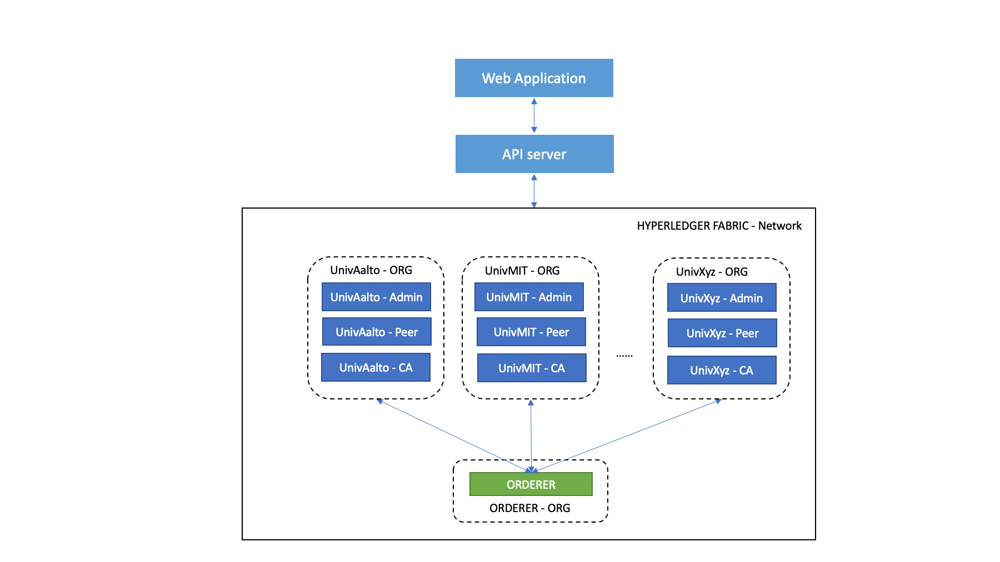
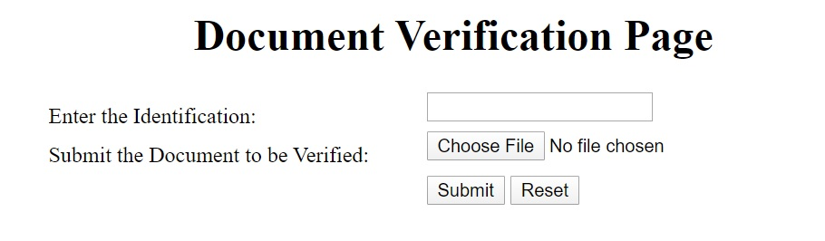

# desrist2020-demo
Source code for Blockchain certified Documents for trusted information (BC-DTI) for conference [DESRIST2020](http://desrist2020.org/).
TODO: Fill-in more information about his application/demo

### Repository Overview
* hyperledger-chaincode/ - Contains chaincode for this application
* hyperledger-api-server/ - API server implementation for the chaincode
* website/ - Frontend for the application

### Architecture diagram



### Web Interfaces




### Prerequisites
1. golang >= 1.13.5
2. Hyperledger Fabric = 1.4.4

### Deployment
1. Package the chaincode, this will create `dti.tgz` in the current directory
```
cd hyperledger-chaincode/dti/
make pkg
```
2. Copy the package to hyperledger fabric host
```
scp dti.tgz  $IP:$DIR/fabric-samples/chaincode/
```
3. Log-in to the `cli` container and extract the package to `chaincode` directory.
```
docker exec -it cli bash
cd /opt/gopath/src/github.com/chaincode
tar -zxvf dti.tgz
cd -
```
4. Obtain the `sha256sum` of a test ID and Document
```
ID=$(echo '111092-221P'|sha256sum|awk {'print $1'})
DOC=$(sha256sum /opt/gopath/src/github.com/chaincode/dti/testdata/test_doc.txt|awk {'print $1'})
```
5. Install and instantiate the chaincode on channel `mychannel` on `Org1`.
```
export ORDERER_CA=/opt/gopath/src/github.com/hyperledger/fabric/peer/crypto/ordererOrganizations/example.com/orderers/orderer.example.com/msp/tlscacerts/tlsca.example.com-cert.pem
export CHANNEL_NAME=mychannel

peer chaincode install -n dti -v 0.0.1 -p github.com/chaincode/dti
peer chaincode instantiate -n dti -v 0.0.1 -C mychannel -c '{"Args":["'$ID'", "'$DOC'"]}' -P "OR('Org1.peer')" -o orderer.example.com:7050 --tls --cafile $ORDERER_CA
```
6. Query and test
```
peer chaincode query -n dti -c '{"Args":["query","'$ID'"]}' -C mychannel
```
Output should be something like: `c71d239df91726fc519c6eb72d318ec65820627232b2f796219e87dcf35d0ab4` which is equivalent of `$DOC`
