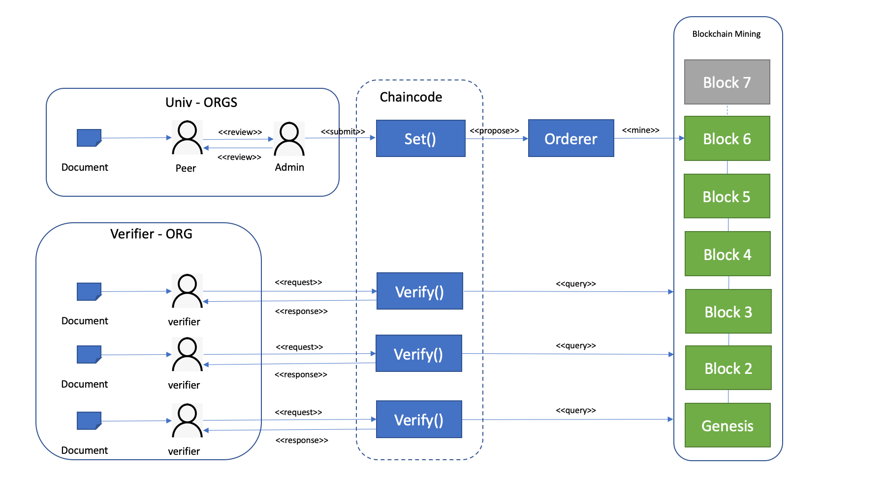

# desrist2020-demo
Source code for Blockchain certified Documents for trusted information (BC-DTI) for conference [DESRIST2020](http://desrist2020.org/).
TODO: Fill-in more information about his application/demo

## Repository Overview
* hyperledger-chaincode/ - Contains chaincode for this application
* hyperledger-api-server/ - API server implementation for the chaincode
* website/ - Frontend for the application

## Architecture diagram - High level

<!--  -->


## Architecture diagram - Hyperledger fabric network v2.0

<!--  -->


## Web Interfaces
### University view
<!-- -->


### Recruiter/Verifiers view
<!--  -->


## Work flow diagram


### Work flow - Uploader
1. The acceptor of the university uploads the document which needs to be inserted to the system.
2. The SHA256 of the document is calculated and awaits for approver for endorsement.
3. The approver verifies the correctness of the document and signs it.
4. This is send to the chaincode which submites the transaction proposal to the orderer.
5. Orderer orders a new transaction and mines a fresh block with the data.

### Work flow - Verifier
1. The verifier uploads the document to be verified from the verification page.
2. The SHA256 of the document is calculated and submits to the chaincode.
3. The chaincode fetches the correct SHA256 of the document from the blockchain and verifies it with the one SHA256 provided by the verifier.
4. The chaincode returns true or false based on check.

## Prerequisites
1. golang >= 1.13.5
2. Hyperledger Fabric = 1.4.4

## Deployment
1. Optional: Install system packages necessary for fabric
```
./run.sh fabric-system
```
2. Install the fabric itself
```
./run.sh fabric-platform
```
3. Get the test network up with `cvchannel`
```
./run.sh fabric-up
```
4. Install the chaincode
```
./run.sh cc
```
5. Obtain the `sha256sum` of a test ID and Document
```
ID=$(echo '111092-221P'|sha256sum|awk {'print $1'})
DOC=$(sha256sum /opt/gopath/src/github.com/chaincode/dti/testdata/test_doc.txt|awk {'print $1'})
```
6. Install and instantiate the chaincode on channel `mychannel` on `Org1`.
```
export ORDERER_CA=/opt/gopath/src/github.com/hyperledger/fabric/peer/crypto/ordererOrganizations/example.com/orderers/orderer.example.com/msp/tlscacerts/tlsca.example.com-cert.pem
export CHANNEL_NAME=mychannel

peer chaincode install -n dti -v 0.0.1 -p github.com/chaincode/dti
peer chaincode instantiate -n dti -v 0.0.1 -C mychannel -c '{"Args":["'$ID'", "'$DOC'"]}' -P "OR('Org1.peer')" -o orderer.example.com:7050 --tls --cafile $ORDERER_CA
```
7. Query and test
```
peer chaincode query -n dti -c '{"Args":["query","'$ID'"]}' -C mychannel
```
Output should be something like: `c71d239df91726fc519c6eb72d318ec65820627232b2f796219e87dcf35d0ab4` which is equivalent of `$DOC`
